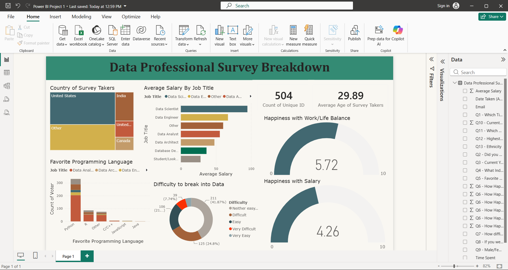

# Power BI Data Analytics & Visualization Portfolio

This repository hosts a collection of professional, production-ready Power BI business intelligence dashboards built to transform raw metrics into actionable data stories, optimize schema modeling, and deliver cross-filtered executive insight layers.

---

## 📊 Project 1: Data Professional Survey Dashboard

### 📌 Project Overview
Developed an interactive business intelligence dashboard using a real-world survey dataset to analyze the career landscapes, compensation tiers, and entry barriers for modern data professionals (Data Analysts, Scientists, Engineers, etc.).

### 🛠️ Data Metrics & Fields Analyzed
- **Demographics:** Participant age distribution and geographic country mapping.
- **Compensation:** Average salary aggregates grouped dynamically by specific job titles.
- **Industry Entry:** Candidate feedback evaluating exactly how difficult it was to break into the data field.

### ⚡ Key Features & Power BI Techniques
- **Relational Data Modeling:** Created an optimized data structure using proper field parameters to handle survey columns cleanly (`DataModel`).
- **Interactive DAX Measures:** Programmed custom aggregation metrics to compute true `Average Salary` across fluctuating industry titles.
- **Cross-Filtering Visuals:** Configured interactive charts allowing users to click a specific job role and instantly see its corresponding salary range, average age, and entry difficulty breakdown.
- **Professional UI Design:** Styled the layout using a clean, modern dashboard template (`Frontier.json`) with hidden background gridlines for an executive-ready look.

### 📷 Dashboard Interface Preview

  

---

## 📁 Repository Structure
- `/Power BI Project 1` — Fully interactive data professional survey dashboard and relational data model.
